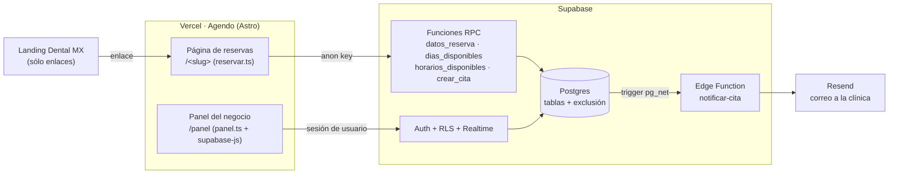

# PRD — Agendo, sistema de reservaciones (primer cliente: Dental MX)

Oct 2, 2026 · @Jorge · Ajustado al proyecto real el Oct 3, 2026

## Resumen

**Agendo** (carpeta `agendo/`, Astro estático en Vercel) es un software de reservas propio, con diseño neutro que no usa los colores de ningún negocio, para usarlo con varios clientes. Cada negocio tiene su página de reservas en `/<slug>` (ej. `/dental-mx`) y un panel en `/panel` personalizado con su nombre. La landing de Dental MX (`dental-mx/`) sólo enlaza a su página en Agendo. El backend vive en Supabase y es multi-negocio (columna `negocio_id`).

**Objetivos**

- El paciente agenda una cita en menos de 1 minuto desde el celular.
- Imposible agendar dos citas en el mismo horario.
- La clínica ve y gestiona su agenda sin tocar código, y se entera al instante de cada cita nueva.
- Costo de operación: $0 en los planes gratuitos de Supabase, Vercel y Resend.

## Decisiones (Oct 3)

| Tema | Decisión |
| --- | --- |
| Producto | Software aparte (Agendo), neutro y multi-negocio. Muestra el nombre, giro y dirección del negocio; colores propios (índigo sobre blanco). |
| Botones | Los botones "Agendar" de la landing son enlaces a `agendo-reservas.vercel.app/dental-mx` (con `?servicio=` cuando aplica). WhatsApp queda para preguntas y como respaldo si no hay enlace (`PUBLIC_AGENDO_URL` vacía). |
| Horario y duraciones | Simulación: horario de la landing (L–V 10:00–14:00 y 16:00–20:00, sábado 10:00–14:00) y duraciones inventadas. Confirmar con la clínica. |
| Aviso de cita nueva | Los dos: correo (Resend) y panel en tiempo real con sonido y notificación del navegador. |
| Supabase | Proyecto nuevo `dental-mx` en la organización de Jorge (plan gratis, us-east-1). |
| Rama | PR #2 del sitio fusionado a `main`; las reservas se desarrollan después. |

## Alcance del MVP

| Entra en el MVP | Queda para después |
| --- | --- |
| Catálogo de servicios con duración | Varios dentistas con agenda propia |
| Horario semanal y bloqueos de fechas u horas | Pagos o anticipos en línea |
| Página de reservas por negocio (`/<slug>`) | Recordatorios automáticos al paciente (SMS o correo) |
| Confirmación por WhatsApp con link wa.me | Sincronización con Google Calendar |
| Panel de la clínica: ver, confirmar, cancelar, bloquear | Historial clínico o datos médicos |
| Aviso de cita nueva: correo + tiempo real con sonido | Que el paciente cancele o cambie su cita solo |
| Base multi-negocio y tope diario contra abuso | Panel para administrar varios clientes desde una sola cuenta |

No se guardan datos médicos: sólo nombre, teléfono, servicio y una nota corta opcional.

## Servicios simulados (seed)

| Clave (slug de la landing) | Servicio | Duración |
| --- | --- | --- |
| atencion-personalizada | Valoración | 30 min |
| ortodoncia | Ortodoncia | 60 min |
| blanqueamientos | Blanqueamiento | 90 min |
| resinas-esteticas | Resinas estéticas | 60 min |
| implantes | Implantes | 60 min |
| piezas-dentales | Piezas dentales | 60 min |

La clave permite que un enlace llegue con el servicio ya elegido: `/dental-mx?servicio=ortodoncia`.

## Arquitectura

- La página de reservas usa la anon key y sólo llama funciones RPC (con `fetch`, sin librería). Las tablas quedan cerradas por RLS. `vercel.json` reescribe `/<slug>` a la página de reservas.
- El panel entra con Supabase Auth y sólo ve su negocio. Recibe las citas nuevas por Realtime y, de respaldo, revisa cada minuto.
- Agendo necesita `PUBLIC_SUPABASE_URL` / `PUBLIC_SUPABASE_ANON_KEY` (proyecto Vercel `agendo`, raíz `agendo/`). La landing ya no usa Supabase.

## Modelo de datos y seguridad

Archivos: `agendo/supabase/migrations/` (4 migraciones), `seed.sql`, `configurar.sql`, `tests/pruebas_reservas.sql`.

| Tabla | Campos clave | Notas |
| --- | --- | --- |
| negocios | id, slug, nombre, giro, direccion, whatsapp, zona_horaria, email_notificaciones, reglas | Reglas configurables: anticipación (2 h), días máx. (30), paso (30 min), pendientes por teléfono (2), tope diario (40) |
| servicios | id, negocio_id, clave, nombre, duracion_min, activo | |
| horarios | negocio_id, dia_semana (0–6), abre, cierra | Varias filas por día (hora de comida) |
| bloqueos | id, negocio_id, inicio, fin, motivo | |
| citas | id, negocio_id, servicio_id, inicio, fin, nombre, telefono, nota, estado, creada_en, notificada_en | estado: pendiente, confirmada, cancelada |
| admins | user_id, negocio_id | Liga usuarios de Supabase Auth con su negocio |
| ajustes_internos | clave, valor | URL de funciones; nadie la lee por la API |

**Reglas de seguridad**

- RLS activo en todas las tablas; permisos de tabla explícitos además de RLS.
- Público (anon): sólo lee servicios activos; no puede leer ni insertar citas, ni leer negocios.
- Público agenda y consulta sólo con funciones `security definer` (`search_path` vacío).
- Restricción de exclusión `btree_gist` sobre `tstzrange(inicio, fin, '[)')` por negocio, excluyendo canceladas: impide citas encimadas aunque lleguen al mismo tiempo; permite citas seguidas.
- La clínica sólo ve y edita lo de su negocio, y de las citas sólo puede cambiar el `estado`.

**Reglas de negocio en `crear_cita`** (todas del lado del servidor)

- El inicio debe ser exactamente un horario ofrecido: dentro del horario, fuera de bloqueos y citas, en pasos de 30 min, con 2 h mínimas de anticipación y máximo 30 días.
- La hora de fin la calcula la base de datos con la duración del servicio.
- Teléfono de 10 dígitos (acepta +52 / 521 y lo normaliza); máximo 2 citas pendientes por teléfono.
- Tope de citas creadas por día (freno contra bots que llamen la API directo) y campo trampa.
- Errores con código (`HORARIO_OCUPADO`, `LIMITE_TELEFONO`, …) que la página de reservas traduce a español.

## Requisitos funcionales (implementados)

**Página de reservas** — `agendo/src/pages/reservar.astro`, `src/scripts/reservar.ts` (ruta `/<slug>`)

- Encabezado con el negocio (iniciales, nombre, giro y dirección) y pasos 1-2-3; resumen lateral en escritorio.
- Servicio → calendario de 30 días (sólo días con horarios) → horas libres (mañana / tarde) → datos → éxito con "Avisar por WhatsApp".
- Estados de carga, "sin horarios ese día", errores claros y salida a WhatsApp; negocio inexistente muestra un aviso.
- Si alguien ganó el horario, avisa y recarga las horas.

**Panel** — `agendo/src/pages/panel.astro`, `src/scripts/panel.ts` (ruta `/panel`, `noindex`)

- Login con correo y contraseña (Supabase Auth); el panel toma el nombre del negocio del usuario.
- Inicio: saludo con el nombre del negocio, números del día (citas hoy, por confirmar, próximos 7 días, reservas nuevas), siguiente cita, "Por confirmar" con botones grandes y la línea del día.
- Agenda por día o semana (columnas en escritorio, lista en celular), filtros por estado y detalle de cita.
- Confirmar, Cancelar (libera el horario) y WhatsApp al cliente con mensaje listo.
- Bloqueos: día completo o rango de horas, con lista y opción de quitar.
- Mi página: enlace de reservas (copiar, abrir, compartir), servicios visibles (interruptor) y horario.
- Avisos: tiempo real, sonido, notificación del navegador y contador en la pestaña.
- Barra lateral en escritorio y pestañas abajo en celular.

**Correo** — `agendo/supabase/functions/notificar-cita` (Resend). Un correo por cita, idempotente, con enlace al panel.

**Mantenimiento** — `.github/workflows/supabase-keepalive.yml` consulta Supabase dos veces por semana para que el plan gratis no se pause.

## Puesta en marcha

Proyecto Supabase: `dental-mx` (ref `pfqswksorjvxtpbcuoam`, us-east-1, plan gratis).

- [x] Proyecto creado; 4 migraciones aplicadas y seed cargado.
- [x] Pruebas (`supabase/tests/pruebas_reservas.sql`) en la base real: todas pasan.
- [x] Realtime activo en `citas`; `pg_net` y trigger de avisos configurados (`ajustes_internos.url_funciones`).
- [x] Edge Function `notificar-cita` desplegada (verify JWT desactivado: se protege sola). Probada: el trigger la llama y responde.
- [x] Usuario de la clínica creado y ligado a Dental MX (credenciales entregadas por chat; cambiar la contraseña).
- [x] Proyecto Vercel `agendo` (raíz `agendo/`) con `PUBLIC_SUPABASE_URL` y `PUBLIC_SUPABASE_ANON_KEY`; dominio `agendo-reservas.vercel.app`.
- [x] Landing de Dental MX enlazando a `agendo-reservas.vercel.app/dental-mx`.
- [ ] Correo de avisos: falta la `RESEND_API_KEY` (secreto en Supabase → Edge Functions) y `negocios.email_notificaciones`.
- [ ] Desactivar el registro público en Supabase → Authentication → Sign In / Providers → "Allow new users to sign up".
- [x] Keep-alive con la URL y anon key públicas en el workflow (GitHub sólo programa workflows de la rama `main`: se activa al fusionar).
- [ ] Borrar la cita de prueba "Prueba Sistema" (quedó cancelada; no ocupa horario).

## Criterios de aceptación

Verificados en local (Postgres 16 + PostgREST + navegador en celular simulado). Falta repetirlos en producción.

- [x] Un paciente agenda desde el celular en menos de 1 minuto.
- [x] Dos pestañas que intentan el mismo horario: sólo una lo consigue y la otra ve un aviso claro.
- [x] No aparecen horarios fuera del horario, en bloqueos, en el pasado ni a menos de 2 horas.
- [x] Un servicio de 60 min no se ofrece a las 13:30 si la clínica cierra a las 14:00.
- [x] Un teléfono con 2 citas pendientes no puede agendar una tercera.
- [x] Con la anon key, `select * from citas` devuelve error.
- [x] El botón de WhatsApp abre el chat de la clínica con el mensaje correcto.
- [x] La clínica ve la cita nueva en el panel y puede confirmarla y cancelarla.
- [x] Una cita cancelada libera su horario.
- [x] Un bloqueo creado en el panel oculta esos horarios en la página de reservas.
- [x] Las horas mostradas coinciden con la hora de Torreón.
- [ ] Llega el correo de cita nueva (requiere Resend configurado).
- [ ] El panel muestra "En vivo" y avisa sin recargar (requiere Realtime de Supabase).
